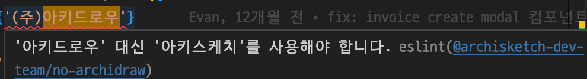
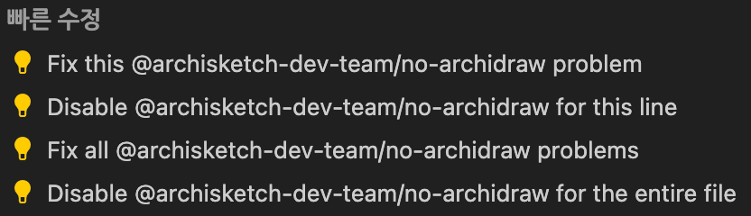

# 100%

ESLint plugin for Archisketch Dev Team

이 프로젝트는 문서 관리, 프로젝트 기여 방법, 코드 스타일 및 규칙, 빌드부터 패키지 배포까지 모든 과정을 자동화하여 개발자들이 프로젝트 관리에 드는 시간과 노력을 크게 줄일 수 있도록 설계되었습니다.

<div class="absolute bottom-10 left-10">
  <span class="font-700">
    Ben / 2024.05.17
  </span>
</div>

<div class="abs-br m-6 flex gap-2">
  <a href="https://github.com/slidevjs/slidev" target="_blank" alt="GitHub" title="Open in GitHub"
    class="text-xl slidev-icon-btn opacity-50 !border-none !hover:text-white">
    <carbon-logo-github />
  </a>
</div>

<!--
The last comment block of each slide will be treated as slide notes. It will be visible and editable in Presenter Mode along with the slide. [Read more in the docs](https://sli.dev/guide/syntax.html#notes)
-->

---
layout: two-cols
layoutClass: gap-16
---

# 목차

<p class="pt-4">플러그인을 만든 이유, 적용 방법, 기여 방법에 대해 설명합니다.</p>

::right::

<Toc v-click minDepth="1" maxDepth="2" class="transition-all"></Toc>

---
layout: statement
transition: slide-up
level: 2
---

# 왜 필요한가요?

<br />

커져가는 프로젝트

일관되지 않은 코딩 스타일 및 네이밍

커뮤니티에서 만들어진 규칙만으로 부합하지 않는 조직 내 요구사항들


<p v-after class="absolute bottom-23 left-45 opacity-30 transform -rotate-10">자세히🦭</p>

<!--
You can have `style` tag in markdown to override the style for the current page.
Learn more: https://sli.dev/guide/syntax#embedded-styles
-->

<style>
h1 {
  background-color: #2B90B6;
  background-image: linear-gradient(45deg, #4EC5D4 10%, #146b8c 20%);
  background-size: 100%;
  -webkit-background-clip: text;
  -moz-background-clip: text;
  -webkit-text-fill-color: transparent;
  -moz-text-fill-color: transparent;
}
</style>

<!--
Here is another comment.
-->

---
transition: fade-out
---

## 커져가는 프로젝트

<p class="pt-4">여러 개발자의 손을 거쳐 다양한 기술과 라이브러리가 혼재되어 있는 등 여러 문제가 있습니다:</p>

<div v-click>

- 비동기 상태 관리를 위해 Tanstack-query와 SWR을 혼합해서 사용
- 날짜를 다루기 위해 Moment, Dayjs를 혼합해서 사용

해결하고자 하는 문제가 비슷한 라이브러리를 중복 사용함으로써 코드 복잡함은 증가했고 일관성은 저하되었습니다.

설상가상으로 낮은 버전대를 사용하고 있어 각 모듈 종속성이 꼬여 함부로 무언가를 업데이트하지 못 합니다. 예로 React17은 Tanstack-query v5와 함께 사용할 수 없습니다.

</div>


<div v-click>

<del>최근 마이그레이션 작업을 끝내 꽤 안정적입니다.</del>

</div>

---
transition: fade-out
---

## 일관된 코딩 스타일

<p class="pt-4">일관된 코딩 컨벤션을 가지면 코드를 읽기 쉬워지고, 안티 패턴을 방지할 수 있습니다. 결과로 버그도 줄고, 코드를 쉽게 유지보수할 수 있게 됩니다.</p>

하지만 이것을 사람이 직접 관리하는 것은 한계가 있기 때문에, ESLint와 같은 정적 분석 도구를 이용하게 됩니다. 그럼 코드 작성 단계에서 기계적으로 잡아낼 수 있습니다.

---
transition: slide-left
---

## 커뮤니티에서 만들어진 규칙만으로 부합하지 않는 조직 내 요구사항들

ESLint에서는 생태계 내 다양한 플러그인을 통해 자주 사용되는 코딩 컨벤션을 커버할 수 있습니다. 하지만 우리 회사의 컨벤션에 맞는 규칙은 없습니다. 조직이 커지고 요구사항이 변화하게 되면서 커뮤니티에서 만들어진 규칙만으로는 조직 내 사용례에 **정확히 부합하지 않는** 경우가 생깁니다. 사내 프로젝트 내 라이브러리 사용에 대한 컨벤션을 정의하거나, 조직 내 컨벤션과 일반적인 커뮤니티에서 통용되는 컨벤션이 다소 다를 수 있습니다.

<div v-click>

```js twoslash
import swr from 'swr'; // trigger error!

const company = '아키드로우'; // trigger error!
```

예를 들어 비동기 데이터 관리하는 라이브러리는 `Tanstack-query`만 사용하고 싶다던가, 이전 사명인 `아키드로우`를 사용하는 케이스가 있겠습니다. 이러한 경우 코드를 사전에 감지하여 오류를 예방할 수 있다면 큰 도움이 되겠죠.

</div>

---
transition: fade-out
layout: two-cols
layoutClass: gap-8
level: 2
---

보통 위 운영 부채를 해결하기 위해, 해결하고자 하는 문제가 비슷한 라이브러리를 하나로 통일하기로 약속합니다.

<div v-click>

**❝비동기 데이터 관리는 swr이 아닌 Tanstack-query로 통일합시다❞**

</div>

<div v-click>

이전 사명인 '아키드로우'는 사용하지 않도록 하며 기능을 담당하는 로직은 특정 폴더에 넣는다 등 정보들은 보통 리드미 또는 노션에 작성됩니다.

</div v-click>


<div v-click>

```md twoslash
### Tech Spec
비동기 데이터 관리는 Tanstack-query를 사용합니다.

### Structure
음식 추가를 담당하는 모듈은 `features/order/` 폴더에 작성하면 됩니다.

### Business
이전 사명을 값으로 사용해선 안 됩니다. ex) '아키드로우', 'archidraw'

그 외 요구사항들...
```

</div>

::right::

<div v-click>

리드미 파일에 주의사항을 기재하거나 직접 대화를 통해 전달하는 방법은 새로운 개발자가 쉽게 놓칠 수 있고, 지속적인 관리가 어렵다는 단점이 있습니다.

이러한 변화들을 프로젝트에 새로 합류하는 개발자들에게 전달하는 더 좋은 방법은 없을까요?

</div>

<div v-click>

<p class="py-16 text-xl font-extrabold">코드 작성 단계에서부터 이러한 요구사항을 잘 아는 누군가가 옆에서 가이드하는 건 어떨까요?</p>

</div>

---
transition: slide-left
---

## ESLint Plugin

이 패키지가 이를 도와주는 가이드 역할을 합니다.

먼저, 왜 간단한 정규식을 놔두고 ESLint 플러그인을 구현했는지 궁금할 수도 있습니다

제가 `Editor` 프로젝트를 개발하던 시절에, 코드 리뷰에서 디버깅 코드 포함 여부같은 사소한 리뷰를 방지하고자 로그가 함부로 찍히지 않도록 `console.log` 사용을 제한하는 규칙을 만들었습니다:

```shell
  no_console () {
    consoleRegexp='^[^-].*console.log'
    filenameRegexp='^[^-].*console.log(\|^+++'

    if test "$(git diff --cached | grep -c "$consoleRegexp")" != 0
    then
      git diff --cached | grep -ne "$filenameRegexp" | grep -B1 "$consoleRegexp"
      printf "\nSome files include ${red}console.log${no_color}.\n"
      confirm
    fi
  }
  check_branch
  no_console
```

<div v-click>

하지만 이 방법은 의도한만큼 **정확하게 동작하지 않습니다.** 예를 들어서,문자열 또는 주석 내부에 있는 `console.log`를 구분하지 못합니다. 더 정교한 정규식을 구현해 대응할 수 있지만 관리하기 매우 힘들어지니, AST를 사용하는 게 더 좋습니다.

</div>

---
transition: fade-out
layout: two-cols
layoutClass: gap-8
---

## RegExp

```js {0|1-2|4-5|7-8|all} twoslash
// trigger error!
console.log("디버깅해볼게요")

// trigger error!
const alertMessage = "console.log()는 개발 환경에서만 사용해주세요"

// trigger error!
// console.log("디버깅해볼게요")
```

<div v-after>

<h6 class="opacity-40 pt-4">PROS</h6>

- 구현이 간단합니다

<h6 class="opacity-40">PROS</h6>

- 복잡한 요구사항에 적합하지 않습니다
- 유지보수가 쉽지 않습니다

</div>

::right::

## AST

```js {0|1-2|4|6|all} twoslash
// trigger error!
console.log("디버깅해볼게요")

const alertMessage = "console.log()는 개발 환경에서만 사용해주세요"

// console.log("디버깅해볼게요")
```

<div v-after>

<h6 class="opacity-40 pt-4">PROS</h6>

- 관리가 용이합니다.
- 복잡한 비즈니스 요구사항에 대해 구현 가능합니다

<h6 class="opacity-40">PROS</h6>

- 유지보수를 위해선 AST에 대한 지식이 필요합니다 => "기여하기" 섹션에서 자세히 설명합니다.

</div>

---
layout: statement
transition: slide-up
---

# 라이브러리 기여 가이드

라이브러리를 활용하는 방법에 대해 알아보겠습니다.

---
transition: fade-out
---

## 규칙을 어떻게 직접 정의할 수 있을까요?

ESLint의 파서인 espree를 사용해 소스 코드를 AST로 변환하고, 정의한 규칙을 직접 플러그인을 통해 정의하고 실행할 수 있습니다.

Espree AST만 읽을 수 있다면 ESLint 규칙을 쉽게 만들 수 있습니다. `AST`에 익숙하지 않은 경우 [기여 가이드 문서](https://github.com/archisketch-dev-team/eslint-plugin-archisketch/blob/master/CONTRIBUTING.md)에서 도움이 될 만한 몇 가지 리소스를 제공합니다. 🍺

이전 사명인 소스 코드에서 '아키드로우'를 값으로 사용하면 '아키스케치'로 바꿔야 한다고 알려주는 no-archidraw와 같은 규칙을 어떻게 정의할 수 있는지 알아보도록 하겠습니다.

---
transition: fade-out
---

## no-archidraw 규칙 정의하기

먼저 코드 내 문자열이 Espree AST에서 어떻게 표현되는지 파악해야 합니다.

1. AST Explorer에 접속합니다.
2. 코드 입력 영역에 `const name = '아키드로우';`를 입력합니다.
3. 파서 설정에서 `Espree`를 선택합니다.

---
---

```js twoslash
const name = '아키드로우';
```

입력한 코드는 다음과 같은 AST 구조로 변환됩니다:

```json {all|11-13} twoslash
{
  "type": "VariableDeclaration",
  "declarations": [
    {
      "type": "VariableDeclarator",
      "id": {
        "type": "Identifier",
        "name": "name"
      },
      "init": {
        "type": "Literal",
        "value": "아키드로우",
        "raw": "'아키드로우'"
      }
    }
  ],
  "kind": "const"
}
```

이해하기 쉽게 일부 정보는 생략했습니다. `Literal` 타입의 노드에서 `value`를 읽으면 문자열 내용을 알 수 있습니다.

---
---

## 예외 상황 처리

```js twoslash
console.log('아키드로우');
console.log('archidraw');
import { A } from 'archidraw-dev-team';
```

사내에서 어쩔 수 없이 `archidraw-*` 형식의 이름의 패키지를 사용하는 경우나 콘솔이나 변수명으로 사용할 때는 어떻게 해야 하나? 궁금할 수도 있습니다.

<div v-click>

위 import 구문은 AST로 변환했을 때 `ImportDeclaration` 타입의 노드를 가집니다. 반면 const 구문은 `VariableDeclaration` 타입의 노드를 가지죠. 원한다면 확실하게 구분할 수 있는 장치가 있다는 것입니다. 이게 AST가 빛을 발하는 부분입니다.

</div>

---
---

<p class="text-sm">이제 이를 기반으로 아래와 같이 ESLint 규칙을 정의할 수 있습니다. 아래 코드는 <span v-mark.red="1">Literal을 만났을 때</span>, 그 Literal의 값이 <span v-mark.circle.orange="2">'아키드로우'를 포함</span>하는 문자열이면 에러를 <span v-mark.green="3">리포트</span>하고 올바른 문자열로 <span v-mark.circle.blue="4">수정</span>하는 코드입니다. 실제 함수는 이것보다 조금 더 복잡하지만 핵심 로직은 이게 전부입니다.</p>

````md magic-move
```js
module.exports = {
  meta: {
    /* ... */
  },
  create: function (context) {
    return {

    }
  }
}
```

```js {7-9}
module.exports = {
  meta: {
    /* ... */
  },
  create: function (context) {
    return {
      Literal(node) {

      }
    }
  }
}
```

```js {9-11}
module.exports = {
  meta: {
    /* ... */
  },
  create: function (context) {
    return {
      Literal(node) {
        if (typeof node.value !== string) return;
        if (/아키드로우/g.test(node.value)) {

        }
      }
    }
  }
}
```

```js {16-18,3-5|all}
module.exports = {
  meta: {
    messages: {
      useKoreanArchisketch: "'아키드로우' 대신 '아키스케치'를 사용해야 합니다.",
    },
    ...
  },
  create: function (context) {
    return {
      Literal(node) {
        if (typeof node.value !== string) return;
        if (/아키드로우/g.test(node.value)) {
          context.report({
            node,
            messageId: 'useKoreanArchisketch',
            fix: function (fixer) {
              return fixer.replaceText(node, node.raw.replace(patternKorean, '아키스케치'));
            },
          })
        }
      }
    }
  }
}
```
````

---
---

## 테스트 작성

이 프로젝트에선 테스트 케이스를 작성할 시간이 충분하다면 작성할 것을 권장합니다. 메인으로 맡아서 하는 프로젝트가 아니므로 다른 PR이 작업을 안전하게 계속할 수 있는 좋은 밑거름이 될 수 있도록 해주세요. 🙏

테스트 케이스를 작성하기 편하도록 테스트 케이스를 생성하고 모듈 참조 테스트 등을 위한 유틸 함수를 제공하고 있습니다. 사용 방법은 아래와 같습니다:

````md magic-move
```js {*|7-13|*}
const path = require('node:path');

const testFilePath = (relativePath) => {
  return path.join(process.cwd(), './tests/files', relativePath);
};

const test = (t) => {
  return {
    ...t,
    filename: testFilePath(t.filename ?? 'foo.mjs'),
    parserOptions: { ecmaVersion: 2020, sourceType: 'module', ...t.parserOptions },
  };
};

module.exports = {
  testFilePath,
  test,
};
```

```js
const { test } = require('./utils');
```

```js
const { test } = require('./utils');
const rule = require('../../../lib/rules/no-archidraw'),
  RuleTester = require('eslint').RuleTester;

const ruleTester = new RuleTester();

ruleTester.run('no-archidraw', rule, {
});
```

```js
ruleTester.run('no-archidraw', rule, {
  valid: [].concat(
    test({
      code: `import { A } from 'archidraw-dev-team';`,
    }),
    test({
      code: `console.log('아키드로우');`,
    }),
  ),
});
```

```js
ruleTester.run('no-archidraw', rule, {
  valid: [].concat(
    test({
      code: `import { A } from 'archidraw-dev-team';`,
    }),
    test({
      code: `console.log('아키드로우');`,
    }),
  ),
  invalid: [].concat(
    test({
      code: `const name = '아키드로우';`,
      errors: [{ messageId: 'useKoreanArchisketch' }],
      output: `const name = '아키스케치';`,
    }),
  ),
});
```
````

---
---

이렇게 작성된 규칙을 ESLint 설정에 추가하면 개발자들이 개발 중 규칙에 맞지 않는 코드를 작성했을 때 알려주고 자동 수정 제안을 할 수 있습니다.





---
transition: slide-left
---

## 이슈 관리

새로운 규칙을 제안하거나 버그가 있다면 [이슈 생성](https://github.com/archisketch-dev-team/eslint-plugin-archisketch/issues/new/choose) 페이지에서 제보할 수 있습니다.


---
---

## 

---
---

# 지속 가능한 개발 문화 조성

이러한 자동화된 도구의 도입은 개발자들이 더 나은 코드를 작성하고, 유지보수 비용을 줄이며, 전반적인 개발 효율은 향상시키는 데 기여할 수 있습니다. 궁극적으로는 운영 부채를 상환하는 데 큰 역할을 할 것입니다.

더 나아가, 이를 바탕으로 더 많은 ESLint 규칙을 만들어 프로젝트의 유지보수성을 향상할 계획입니다. 아래는 작업 예정에 있는 규칙입니다:

- ban-words: [기능 제안 이슈](https://github.com/archisketch-dev-team/eslint-plugin-archisketch/issues/14)에서 해당 규칙에 대해 자세히 설명합니다.
- archi-design/hierarchical-import: 각 폴더의 계층 관계를 명확히 하기 위한 규칙입니다. ex) 폴더 내 모듈에서 stores 폴더 내 모듈을 import할 수 없도록 강제합니다.

좋은 아이디어가 있다면 직접 [구현](https://github.com/archisketch-dev-team/eslint-plugin-archisketch/blob/master/CONTRIBUTING.md)하거나 기능을 [요청](https://github.com/archisketch-dev-team/eslint-plugin-archisketch/issues/new/choose)해주세요.

---

# 마무리

감사합니다

```js
module.exports = {
  extends: [
    'plugin:@archisketch-dev-team/recommended',
  ],
  ...
}
```

<div class="w-60 relative">
  <div class="relative w-40 h-40">
    
    
    
  </div>

  <div
    class="text-5xl absolute top-14 left-40 text-[#2E2EE8] -z-1"
    v-motion
    :initial="{ x: -80, opacity: 0}"
    :enter="{ x: 20, opacity: 1, transition: { delay: 2000, duration: 1000 } }">
    ESLint Plugin Archisketch
  </div>
</div>

<!-- vue script setup scripts can be directly used in markdown, and will only affects current page -->
<script setup lang="ts">
const final = {
  x: 0,
  y: 0,
  rotate: 0,
  scale: 1,
  transition: {
    type: 'spring',
    damping: 10,
    stiffness: 20,
    mass: 2
  }
}
</script>

<div
  v-motion
  :initial="{ x:35, y: 30, opacity: 0}"
  :enter="{ y: 0, opacity: 1, transition: { delay: 3500 } }">

작성자: Ben

</div>

---
transition: fade-out
---

# Components

<div grid="~ cols-2 gap-4">
<div>

You can use Vue components directly inside your slides.

We have provided a few built-in components like `<Tweet/>` and `<Youtube/>` that you can use directly. And adding your custom components is also super easy.

```html
<Counter :count="10" />
```

<!-- ./components/Counter.vue -->
<Counter :count="10" m="t-4" />

Check out [the guides](https://sli.dev/builtin/components.html) for more.

</div>
<div>

```html
<Tweet id="1390115482657726468" />
```

<Tweet id="1390115482657726468" scale="0.65" />

</div>
</div>

<!--
Presenter note with **bold**, *italic*, and ~~striked~~ text.

Also, HTML elements are valid:
<div class="flex w-full">
  <span style="flex-grow: 1;">Left content</span>
  <span>Right content</span>
</div>
-->

---
class: px-20
---

# Clicks Animations

You can add `v-click` to elements to add a click animation.

<div v-click>

This shows up when you click the slide:

```html
<div v-click>This shows up when you click the slide.</div>
```

</div>

<br>

<v-click>

The <span v-mark.red="3"><code>v-mark</code> directive</span>
also allows you to add
<span v-mark.circle.orange="4">inline marks</span>
, powered by [Rough Notation](https://roughnotation.com/):

```html
<span v-mark.underline.orange>inline markers</span>
```

</v-click>

---
layout: center
class: text-center
---

# 자세히 알아보기

[GitHub](https://github.com/archisketch-dev-team/eslint-plugin-archisketch/tree/master) · [Install](https://github.com/archisketch-dev-team/eslint-plugin-archisketch/blob/master/README.md#archisketch-dev-teameslint-plugin-%EC%84%A4%EC%B9%98) · [Contribute Guide](https://github.com/archisketch-dev-team/eslint-plugin-archisketch/blob/master/CONTRIBUTING.md) · [Issue Templates](https://github.com/archisketch-dev-team/eslint-plugin-archisketch/issues/new/choose)
